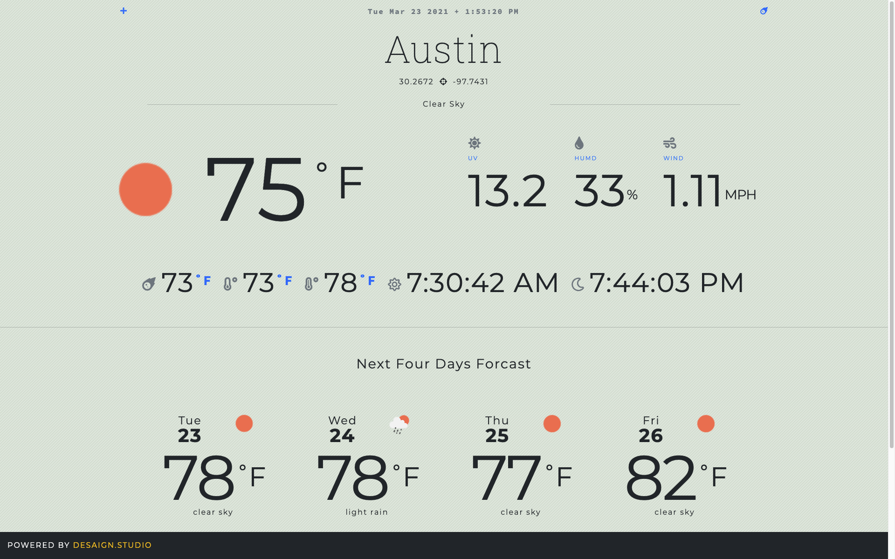

## Another Weather App by Desaign Studio

The app allows the user to see the weather of a number of selected cities. Locations can be changed by pressing the plus icon which allows the user to type in the city's name.

The Another Weather App use Open Weather API as its source of information for the weather. The HTML Geolocation API gives you your current location weather information. 

### Version

- **2103210046**
✔ Last Update  @done (March 23rd 2021, 14:44)

### Framework

- HTML5, CSS3, JavaScript

### Built With

- JQuery, Bootstrap, Geolocation API, Open Weather API, Font Awesome Icons, Google Fonts, SVG

### Software

- Visual Studio Code Editor
- Github for versioning

### Credits

- https://stackoverflow.com/questions/18536726/javascript-to-display-the-current-date-and-time
- https://www.w3schools.com/html/html5_geolocation.asp
- https://openweathermap.org/

### CONTRIBUTE

- A [contributing guideline]('https://github.com/kratuvwxyz/CONTRIBUTE') available.

### LICENSE

- [MIT]('https://github.com/kratuvwxyz/LICENSE') © 2021 Kratu Desai, DESAIGN LLC.

## CONTACT

Thank you for your time and consideration. My mantra is simple, *chase perfection to catch excellence*. I hope you enjoy my work. **I'd love to hear from you.** Please email me at <a href="mailto:github@desaign.studio?Subject=Message from Github">github@desaign.studio</a>.

 &copy; 2011-2021. <a href="https://desaign.app" target="_blank" style="text-decoration:none;">DESAIGN STUDIO</a>. All Rights Reseverd. &#160;
 &#160;
 &#160;
 &#160;
 &#160;

